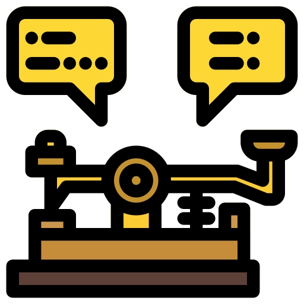

<p align="center">
  <a>
    
  </a>
</p>

<h1 align="center">
  Dash to Dots
</h1>

Single web application made with Angular. Get ready to embark on an educational journey as you become a skilled artisan of Morse code messages. Practice Morse code writing with hands-on exercises that challenge your skills and enhance your proficiency. Feel free to open a pull request in case you have any suggestions to enhance this project.

## Technologies used

- [Angular](https://angular.io/): TypeScript-based open-source web application framework.
- [Tailwind CSS](https://tailwindcss.com/): CSS framework.

## Getting started

1. Open the command prompt and clone the repository:
```sh
git clone https://github.com/alanegd/dash-to-dots.git
```

2. Navigate to the project directory.

3. Run the following command to install the necessary dependencies listed in the package.json file:
```sh
npm install
```

4. Run the Development Server with:
```sh
ng serve 
```

5. Open your web browser and navigate to `http://localhost:4200/` to view the app. 


## Contact
* GitHub: [https://github.com/alanegd](https://github.com/alanegd)
* LinkedIn: [https://www.linkedin.com/in/alan-galavis/](https://www.linkedin.com/in/alan-galavis/)
